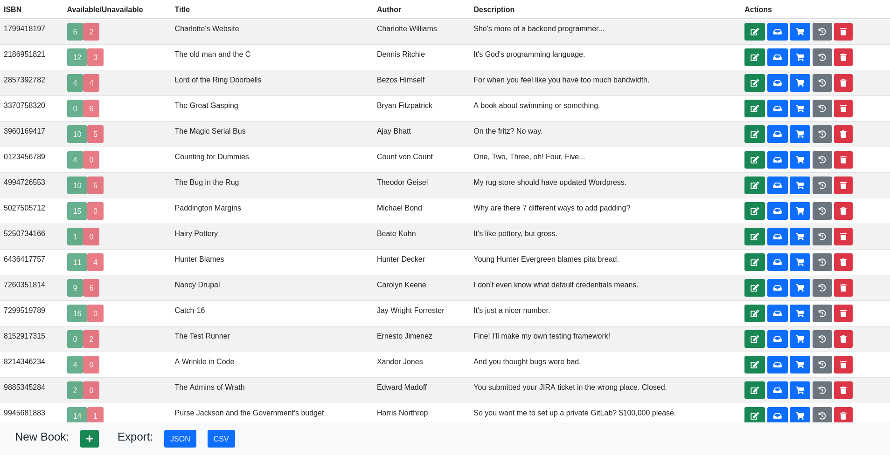
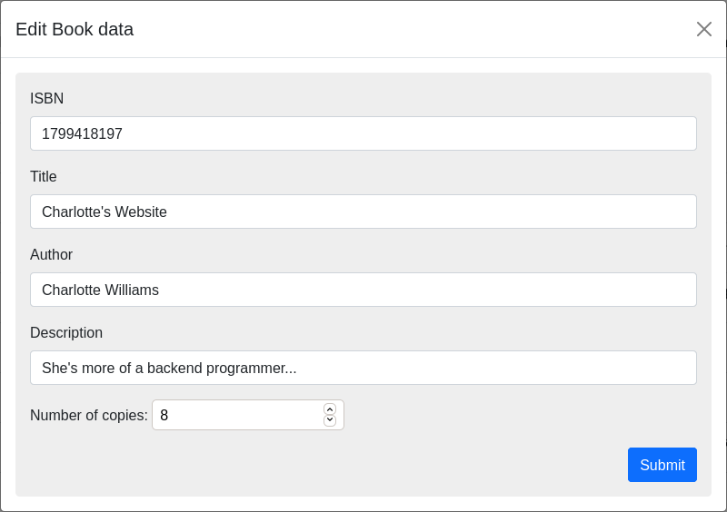
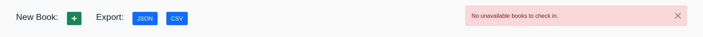

 

# bookstore

The original challenge, in `challenge.md`, called it a "library management system", but variations of this are known as
the "bookstore challenge".

This challenge is deployed live to [https://bookstore.micahparks.com/](https://bookstore.micahparks.com/). View the
OpenAPI/swagger specification and docs [here](https://bookstore.micahparks.com/docs).

## Design

### The backend:

The backend is a Golang HTTP REST API. Its stub is generated from the swagger specification using
[`goswagger`](https://github.com/go-swagger/go-swagger).

Data storage is interacted with via a Go interface, to allow for multiple implementations.

All endpoints are placed under the `/api/` prefix. Any other non-documentation paths will file serve from frontend
assets.

The program is put into a Docker image with the base image [scratch](https://hub.docker.com/_/scratch/).

Deployed live, this sits on my personal VPS alongside other services using `docker-compose` behind a
[Caddy](https://caddyserver.com/) web server serving as a reverse proxy and TLS termination point.

The portable, statically linked executable is a bit less than 11MB. As a compressed docker image, it is 3.84MB.

### The frontend:

The frontend is web app using "plain" HTML and JavaScript. Its assets are embedded directly in the executable for the
server. There are a few external assets are served via CDNs.

The following technologies are used:

* HTML
* JavaScript
* [Boostrap](https://getbootstrap.com/)
* [Font Awesome](https://fontawesome.com/)
* [jQuery](https://jquery.com/)
* The [Official Swagger JavaScript npm module](https://github.com/swagger-api/swagger-js) via
  the [unpkg.com](https://unpkg.com/) CDN.

### Project organization:

The `cmd` directory contains the entrypoint for the server. It was generated by `goswagger`.

The `endpoints` directory contains business logic behind the REST API endpoints. It consumes the data storage interfaces
from the `storage` package.

The `frontend` directory contains all project specific frontend assets which include some JavaScript files and one HTML
file. External frontend dependencies are brought in via CDNs.

The `middleware` directory contains HTTP middleware for the server. The only middleware present is the one used to serve
the frontend assets via a directory from the OS or the embedded assets.

The `models` directory contains the data structures defined in the swagger specification file. It was generated
by `goswagger`.

The `producers` directory contains implementations of the OpenAPI `runtime.Producer` interface. The only producer
defined is a text producer used for the `/api/csv` endpoint.

The `restapi` directory contains most of the server stub generated by `goswagger` including input and output types,
validation, and routing. There is a special file in `restapi/configure_bookstore.go` that was edited by hand to
configure the service.

The `storage` directory contains the interface for backend storage and implementations for it.

The `swagger.yml` file is the swagger 2.0 specification file mentioned previously. It's contents can be viewed in a more
pleasing graphical format at [this link](https://bookstore.micahparks.com/docs).

## Features

* Exporting all data as JSON or current statuses as CSV.
* Type safety around API on the backend. (Input and output validation.)
* Switch between embedded frontend assets and live frontend assets by specifying a directory with the `FRONTEND_DIR`
  environment variable.

## Screenshots

The main screen, a table:

Form submission for Book data:

Delete confirmation dialog:

Fixed bottom navbar with error present:

## Improvements

- [ ] Write Go tests and Postman tests.
- [ ] Implement storage backend interfaces in persistent storage (non-memory).
- [ ] Introduce users, an identity provider, authentication, and authorization.
- [ ] ISBN validation on backend.
- [ ] Add an "On Hold" status and features around that.
- [ ] Form validation on frontend.
- [ ] Allow for bulk transactions through the web frontend (Already on the backend).
- [ ] Handle large strings on the frontend table.
- [ ] Add search functionality.
- [ ] Bulk, per ISBN, transactions for checkin and checkout.
- [ ] Better error messages to users.
- [ ] Don't reload the whole bookstore on the frontend during a refresh. (Backend is capable of this).
- [ ] Format times in a prettier way.
- [ ] Make the web interface prettier.
- [ ] Allow users to edit the number of books with the same ISBN.
- [ ] Use a frontend JavaScript framework (Vue).
- [ ] Make default backend timeout configurable.
- [ ] Support more than 18446744073709551615 books per ISBN.
